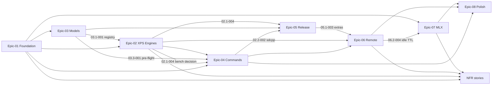

# USER STORIES - PROJECT OVERVIEW

> Generated by `/generate-epics` on 2026-09-24 from `REQUIREMENTS.md`. The epic files under `docs/stories/` are the single source of truth for story definitions, acceptance criteria and progress.

## User Personas

### Primary Personas

#### FX (owner and sole user)
- **Role**: Senior engineer running a personal, local-first AI lab across three machines: `omarchy-xps13` (Dell XPS 13, Intel Arc 140V iGPU, 30 GB shared RAM, Arch Linux), `macbook-pro-m3-max` (macOS, Apple Silicon) and `home-lab` (M1 Pro, always on). Works on the XPS most of the day.
- **Goals**: Generate illustrations for docs, slides and blog posts, plus fan-art and exploration, with one command and no cloud. Use the M3 Max as a render box from the XPS. Know exactly which prompt, seed and engine produced any file.
- **Pain Points**: Does not generate images today; ComfyUI graphs and bespoke diffusers venvs are too much friction to become a habit. Weights are 10–35 GB across several files with no canonical source. Every engine has different flags. A slow iGPU makes wasted runs expensive.

### Secondary Personas

#### Local agents and scripts (future)
- **Role**: Claude Code or a local chat model shelling out to `lig` or calling the daemon.
- **Goals**: Machine-readable results (`--json`), stable exit codes, deterministic file naming.
- **Pain Points**: Progress noise on stdout, colour codes in captured output. Served by Epic-08 and the NFRs; not a v1 driver.

## Epic Overview

| Epic ID | Epic Name | Business Value | Story Count | Total Points | Priority |
|---------|-----------|----------------|-------------|--------------|----------|
| Epic-01 | [Foundation & Core](./stories/epic-01-foundation.md) | Shared models, backend protocol, output naming, config, diagnostics; makes every later story small and testable | 8 | 25 | Must Have |
| Epic-02 | [XPS Engine Spike & Local Backends](./stories/epic-02-xps-engines.md) | Measures whether the XPS can hit ≤ 10 min per 1024²; wraps the winning engines | 8 | 25 | Must Have |
| Epic-03 | [Model Management](./stories/epic-03-model-management.md) | Registry, verified resumable downloads, one cache, memory pre-flight | 6 | 19 | Must Have |
| Epic-04 | [Generation Commands](./stories/epic-04-generation-commands.md) | `generate`, `edit`, `seeds` + contact sheet, `bench` — the product | 6 | 21 | Must Have |
| Epic-05 | [Release & Documentation](./stories/epic-05-release-docs.md) | README, `uv tool install`, commitlint, Phase 1 acceptance run, `v0.1.0` | 4 | 9 | Must Have |
| Epic-06 | [Remote Serving](./stories/epic-06-remote-serving.md) | `lig serve` on the M3 Max + `--host` client so the XPS renders remotely | 8 | 26 | Should Have |
| Epic-07 | [MLX on Apple Silicon](./stories/epic-07-mlx-apple-silicon.md) | mflux backend for Mac speed, transparent output, `pull --for` | 5 | 16 | Should Have |
| Epic-08 | [Polish & Extensions](./stories/epic-08-polish.md) | Prompt rewriter, job queue, `--json`/`--open`/completion, size sheet, OpenVINO evaluation | 5 | 20 | Could Have |
| NFR | [Non-Functional Requirements](./stories/non-functional-requirements.md) | Performance targets, security, accessibility, offline guarantee, reproducibility, pinning | 10 | 18 | Mixed |

## Epic Navigation

- **[Epic-01: Foundation & Core](./stories/epic-01-foundation.md)** - Package skeleton, offline CI, request/result models, `Backend` protocol + `FakeBackend`, output naming with sidecars, layered config, `doctor`, log capture.
- **[Epic-02: XPS Engine Spike & Local Backends](./stories/epic-02-xps-engines.md)** - Phase 0 hand-run bench of sd.cpp Vulkan, ncnn-vulkan, SYCL and torch XPU on the XPS; subprocess runner and `sdcpp`/`ncnn` adapters with stub binaries.
- **[Epic-03: Model Management](./stories/epic-03-model-management.md)** - Registry schema and Qwen-Image-2.1 sets, cache dir, `models list/pull/verify/rm/path`, memory pre-flight.
- **[Epic-04: Generation Commands](./stories/epic-04-generation-commands.md)** - `generate`, progress UI, `edit`, `seeds` with contact sheet, `bench`.
- **[Epic-05: Release & Documentation](./stories/epic-05-release-docs.md)** - README, conventional commits + CHANGELOG, packaging, Phase 1 acceptance and tag.
- **[Epic-06: Remote Serving](./stories/epic-06-remote-serving.md)** - sd.cpp Metal on the Mac, FastAPI daemon (health, generate, edit, SSE, idle TTL, tailnet bind), `RemoteBackend`, overhead measurement.
- **[Epic-07: MLX on Apple Silicon](./stories/epic-07-mlx-apple-silicon.md)** - mflux adapter, MLX edit, Mac bench and default, `--transparent`, `pull --for`.
- **[Epic-08: Polish & Extensions](./stories/epic-08-polish.md)** - P2 backlog, pulled opportunistically.
- **[Non-Functional Requirements](./stories/non-functional-requirements.md)** - Verification stories for the PRD's NFR section.

## MVP Summary

### MVP Criteria
Phase 1 definition of done from `REQUIREMENTS.md` §6: fresh clone → README → 1024² PNG on the XPS in one documented command in ≤ 10 min; `generate`, `edit`, `seeds`, `bench`, `models` all work on the XPS; `docs/bench/xps13.md` names the winning engine; tests green in the offline GitLab container with the coverage gate met; README complete; `v0.1.0` tagged.

### MVP Scope
Epics 01–05 in full, plus the Must Have NFR stories (NFR-PERF-001, NFR-SEC-002, NFR-ACC-001, NFR-INT-001, NFR-INF-001, NFR-INF-002). Phase 0 (Epic-02 Feature 02.1) runs first and gates the rest: if no engine reaches ≤ 600 s at 1024², the fallback in story 02.1-004 is enacted before Epic-04 starts.

### MVP Epic Breakdown
| Epic | Stories | Points |
|---|---|---|
| Epic-01 Foundation & Core | 8 | 25 |
| Epic-02 XPS Engine Spike & Local Backends | 8 | 25 |
| Epic-03 Model Management | 6 | 19 |
| Epic-04 Generation Commands | 6 | 21 |
| Epic-05 Release & Documentation | 4 | 9 |
| NFR (Must Have) | 6 | 11 |
| **MVP total** | **38** | **110** |

## Project Metrics
- **Total Stories**: 60 (50 functional + 10 NFR)
- **Total Story Points**: 179
- **MVP Stories**: 38 (110 points)
- **Post-MVP**: Epic-06 (26), Epic-07 (16), Epic-08 (20), remaining NFR (7) = 69 points
- **Phases**: 0 Spike → 1 XPS local (MVP) → 2 Remote → 3 MLX → 4 Polish

## Story Dependencies

### Cross-Epic Dependencies

### Critical Path
1. **02.1-001 → 02.1-002 → 02.1-003 → 02.1-004** (Phase 0 spike, can start immediately, no code dependencies). Decides the XPS default engine and whether the ≤ 10 min target holds.
2. **01.1-001 → 01.2-001 → 01.2-002 → 01.2-003** (core models, protocol, output) in parallel with the spike.
3. **03.1-001 → 03.1-002** (registry seeded with hashes from the spike downloads).
4. **02.2-004 → 02.2-001 → 02.2-002 / 02.2-003** (runner and adapters, need registry and the spike decision).
5. **01.3-001 → 03.3-001 → 04.1-001** (config, pre-flight, generate) then **04.2-001, 04.3-001 → 04.3-002, 04.4-001**.
6. **05.1-001 → 05.1-004** (README then acceptance run and `v0.1.0`).

Phase 2 starts at **06.1-001** (needs 02.2-002 on macOS) and ends at **06.3-002**; Phase 3 starts at **07.1-001** (needs 06.2-004).

### Sprint Plan (indicative, 1 sprint ≈ 1 week of part-time effort)
| Sprint | Focus | Stories |
|---|---|---|
| 1 | Phase 0 spike + core | 02.1-001..004, 01.1-001, 01.2-001..003 |
| 2 | Config, doctor, CI, registry | 01.1-002, 01.3-001..003, 03.1-001, 03.2-001, 05.1-002, 05.1-003 |
| 3 | Adapters, downloads, generate | 02.2-001..004, 03.1-002, 03.2-002, 03.2-003, 03.3-001, 04.1-001, 04.1-002 |
| 4 | Remaining commands, README, acceptance | 04.2-001, 04.3-001, 04.3-002, 04.4-001, 05.1-001, 05.1-004 |
| 5–6 | Remote serving | Epic-06 |
| 7–8 | MLX | Epic-07 |
| Backlog | Polish | Epic-08 |
